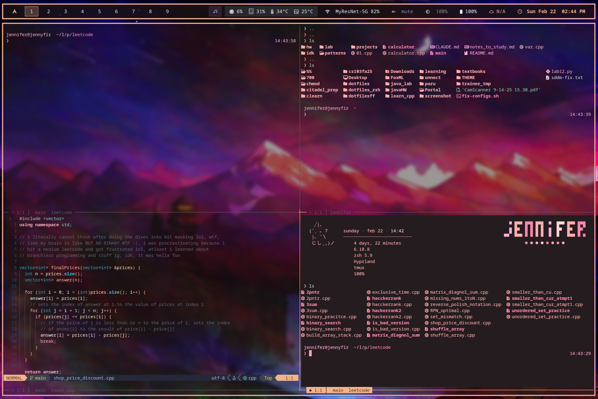

# Fox ML Theme

A dark, crisp theme with peach and lavender accents. No rounded corners.

## Screenshots




## Palette

| Element | Color |
|---------|-------|
| Background | `#1a0d1a` |
| Foreground | `#f5f5f7` |
| Peach (primary) | `#f4b58a` |
| Pink (active) | `#f5a9b8` |
| Lavender | `#9a8ac4` |
| Slate | `#3a414b` |

## Installation

```bash
./install.sh
```

The installer will:
- Back up existing configs
- Install theme files for all supported apps
- Provide post-install instructions

## Supported Applications

| App | Config Location |
|-----|-----------------|
| Hyprland | `~/.config/hypr/modules/theme.conf` |
| Hyprlock | `~/.config/hypr/hyprlock.conf` |
| Hyprpaper | `~/.config/hypr/hyprpaper.conf` |
| Wallpaper | `~/.wallpapers/foxml.png` |
| Neovim | `~/.config/nvim/init.lua` |
| Waybar | `~/.config/waybar/style.css` |
| Kitty | `~/.config/kitty/kitty.conf` |
| Tmux | `~/.tmux.conf` |
| Spicetify | `~/.config/spicetify/Themes/FoxML/` |
| Yazi | `~/.config/yazi/theme.toml` |
| Dunst | `~/.config/dunst/dunstrc` |
| Rofi | `~/.config/rofi/glass.rasi` |
| GTK 3 | `~/.config/gtk-3.0/gtk.css` |
| GTK 4 | `~/.config/gtk-4.0/gtk.css` |
| btop | `~/.config/btop/themes/foxml.theme` |
| Firefox | `<profile>/chrome/userChrome.css` |
| Cursor/VS Code | `~/.cursor/extensions/foxml-theme/` |
| Discord | `~/.config/Vencord/themes/foxml.css` |
| Zsh | `~/.zshrc` + `~/.config/zsh/` + `~/.oh-my-zsh/themes/caramel.zsh-theme` |

## Zsh / Shell

The `zsh/` directory includes the full shell setup:

| File | Description |
|------|-------------|
| `.zshrc` | Main zsh config — Oh My Zsh, completions, fzf, tmux auto-attach |
| `caramel.zsh-theme` | Custom prompt with gradient path, git status, conda/venv, elapsed time |
| `colors.zsh` | LS_COLORS and zsh-syntax-highlighting colors |
| `aliases.zsh` | Aliases for eza, bat, navigation, utilities |
| `welcome.zsh` | Terminal splash screen with system info and todo list |
| `paths.zsh` | PATH setup |
| `conda.zsh` | Conda initialization |

To use:
```bash
# Copy the theme
cp zsh/caramel.zsh-theme ~/.oh-my-zsh/themes/

# Copy zsh config modules
mkdir -p ~/.config/zsh
cp zsh/aliases.zsh zsh/colors.zsh zsh/paths.zsh zsh/welcome.zsh zsh/conda.zsh ~/.config/zsh/

# Copy .zshrc (back up yours first)
cp ~/.zshrc ~/.zshrc.bak
cp zsh/.zshrc ~/.zshrc
```

Requires: [Oh My Zsh](https://ohmyz.sh/), [zsh-syntax-highlighting](https://github.com/zsh-users/zsh-syntax-highlighting), [zsh-autosuggestions](https://github.com/zsh-users/zsh-autosuggestions), [eza](https://github.com/eza-community/eza), [bat](https://github.com/sharkdp/bat)

## Dependencies

- JetBrainsMono Nerd Font
- For Spotify: [Spicetify](https://spicetify.app/)
- For Discord: [Vencord](https://vencord.dev/)

## Post-Install

1. `hyprctl reload`
2. Restart terminals/apps
3. `spicetify backup apply`
4. Firefox: enable `toolkit.legacyUserProfileCustomizations.stylesheets` in `about:config`
5. Cursor: Select "Fox ML" in color theme picker
6. Discord: Enable theme in Settings > Vencord > Themes

## Font

Install JetBrainsMono Nerd Font:
```bash
# Arch
pacman -S ttf-jetbrains-mono-nerd

# Or download from
# https://www.nerdfonts.com/font-downloads
```

## License

Do whatever you want with it.
