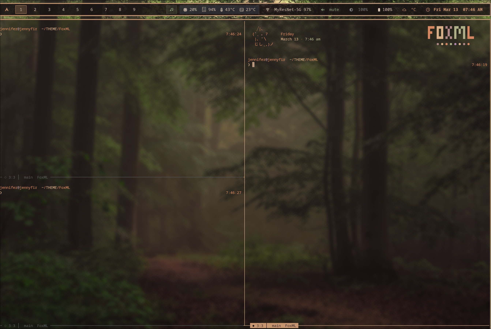
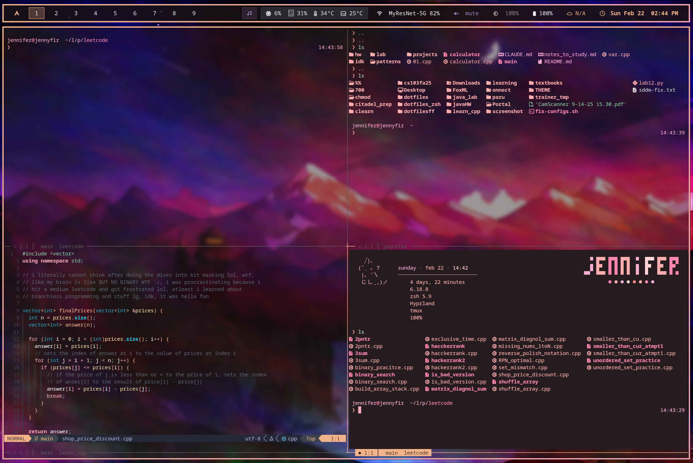
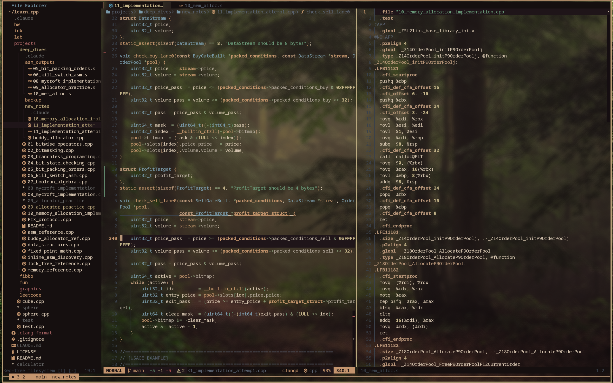

# FoxML Theme Hub

> If you're trying to use this and you messed up your computer and you're in the same CS course as me, it would bring me great enjoyment if instead of asking me for help, you make it the UAB CS faculty's problem.

A template-based multi-theme hub for 23+ apps. Sharp corners, no rounded anything. One set of configs, any number of color schemes.

> **Note:** The multi-theme template system and additional themes (Paper, etc.) are WIP. FoxML Classic is the active, fully working theme.

## Themes

### [FoxML Classic](themes/FoxML_Classic/) (dark)
Dark theme with peach and lavender accents, neon glows, glassmorphic panels.

| Role | Color | |
|------|-------|-|
| Background | `#1a1214` | Warm dark |
| Foreground | `#f5f5f7` | Off-white |
| Primary | `#f4b58a` | Peach |
| Active | `#f5a9b8` | Pink |
| Accent | `#9a8ac4` | Lavender |
| Surface | `#3a414b` | Slate |

### [FoxML Paper](themes/FoxML_Paper/) (light) — *WIP*
Warm light theme — parchment, coffee, and sage. **This theme is a work in progress and may not be fully functional yet.**

| Role | Color | |
|------|-------|-|
| Background | `#f5efe6` | Warm parchment |
| Foreground | `#3b3330` | Warm charcoal |
| Primary | `#8b6d5c` | Coffee brown |
| Active | `#b5704f` | Terracotta |
| Accent | `#7a8b6d` | Sage green |
| Surface | `#d6cdc4` | Warm linen |

## Screenshots







## Quick Start

```bash
# Install a theme (interactive — shows available themes)
./install.sh

# Install a specific theme
./install.sh FoxML_Classic

# Install with system dependencies (Arch packages, Oh My Zsh, zsh plugins)
./install.sh FoxML_Paper --deps

# Swap themes (shows 24-bit color previews in terminal)
./swap.sh

# Pull system config changes back into templates
./update.sh
```

## How It Works

Configs live as **templates** with `{{COLOR}}` placeholders. Each theme is just a `palette.sh` file defining ~60 color variables. At install time, the render engine fills in the placeholders and copies the result to your system.

```
templates/                  <- config files with {{PLACEHOLDER}} tokens
  kitty/kitty.conf            background #{{BG}}, foreground #{{PRIMARY}}, ...
  nvim/init.lua               style = "{{NVIM_STYLE}}", colors with #{{RED}}, ...
  waybar/style.css            @define-color bg #{{BG}}, rgba({{PRIMARY_R}}, ...), ...
  zsh/.zshrc                  %F{{{ANSI_ACCENT1}}}, fg=#{{ZSH_SUGGEST}}, ...
  hyprlock/hyprlock.conf      rgb({{PRIMARY_R}}, {{PRIMARY_G}}, {{PRIMARY_B}}), ...
  ... (29 files across 21 app directories)

themes/
  FoxML_Classic/
    palette.sh              <- defines all colors for Classic
    theme.conf              <- name, type=dark, description
  FoxML_Paper/
    palette.sh              <- defines all colors for Paper
    theme.conf              <- name, type=light, description

shared/                     <- non-color files copied as-is (keybinds, scripts, etc.)

render.sh                   <- template engine (hex, RGB, ANSI, metadata substitution)
mappings.sh                 <- source -> destination file routing + special handlers
install.sh                  <- renders templates + copies to system
update.sh                   <- reverse-renders system configs back into templates
swap.sh                     <- interactive theme switcher with color previews
```

**Adding a new theme** = writing one `palette.sh` file. All 23+ app configs are generated from templates.

**Editing a config** = edit the template, it applies to all themes. Run `./update.sh` to pull changes from your live system back into templates.

## Themed Applications

Every one of these gets its colors from the active theme's `palette.sh`:

| App | Template | Installs To |
|-----|----------|-------------|
| Hyprland | `templates/hyprland/theme.conf` | `~/.config/hypr/modules/theme.conf` |
| Hyprlock | `templates/hyprlock/hyprlock.conf` | `~/.config/hypr/hyprlock.conf` |
| Neovim | `templates/nvim/init.lua` | `~/.config/nvim/init.lua` |
| Kitty | `templates/kitty/kitty.conf` | `~/.config/kitty/kitty.conf` |
| Waybar | `templates/waybar/style.css` | `~/.config/waybar/style.css` |
| Tmux | `templates/tmux/.tmux.conf` | `~/.tmux.conf` |
| Zsh | `templates/zsh/` (7 files) | `~/.zshrc` + `~/.config/zsh/` + caramel prompt |
| Rofi | `templates/rofi/glass.rasi` | `~/.config/rofi/glass.rasi` |
| Dunst | `templates/dunst/dunstrc` | `~/.config/dunst/dunstrc` |
| Mako | `templates/mako/config` | `~/.config/mako/config` |
| Fastfetch | `templates/fastfetch/config.jsonc` | `~/.config/fastfetch/config.jsonc` |
| GTK 3 | `templates/gtk-3.0/gtk.css` | `~/.config/gtk-3.0/gtk.css` |
| GTK 4 | `templates/gtk-4.0/gtk.css` | `~/.config/gtk-4.0/gtk.css` |
| btop | `templates/btop/foxml.theme` | `~/.config/btop/themes/foxml.theme` |
| Yazi | `templates/yazi/theme.toml` | `~/.config/yazi/theme.toml` |
| Zathura | `templates/zathura/zathurarc` | `~/.config/zathura/zathurarc` |
| Spicetify | `templates/spicetify/` (2 files) | `~/.config/spicetify/Themes/FoxML/` |
| Firefox | `templates/firefox/` (2 files) | `<profile>/chrome/userChrome.css` |
| Cursor/VS Code | `templates/cursor/` | `~/.cursor/extensions/foxml-theme/` |
| Discord (Vencord) | `templates/vencord/foxml.css` | `~/.config/Vencord/themes/foxml.css` |
| Bat | `templates/bat/foxml.tmTheme` | `~/.config/bat/themes/Fox ML.tmTheme` |

## Shared (Non-Color) Files

These are copied as-is regardless of theme — keybinds, scripts, layout configs:

| File | Description |
|------|-------------|
| `shared/hyprland_modules/` | 12 Hyprland modules (keybinds, rules, monitors, scratchpads, etc.) |
| `shared/hyprland_scripts/` | 8 helper scripts (lock, startup, yazi, theme switching, etc.) |
| `shared/launchers/` | Toggle scripts for btop, ncspot, spotify, yazi |
| `shared/wallpapers/` | Wallpaper files |
| `shared/hyprpaper.conf` | Hyprpaper config |
| `shared/nvim_lazy-lock.json` | Neovim plugin lock file |
| `shared/nvim_ftplugin/` | Neovim filetype plugins |
| `shared/rofi_config.rasi` | Rofi layout config |
| `shared/waybar_config` | Waybar module/layout config |
| `shared/gtk-{3,4}.0_settings.ini` | GTK settings (font, icon theme) |
| `shared/zsh_aliases.zsh` | Shell aliases |
| `shared/zsh_paths.zsh` | PATH setup |
| `shared/zsh_conda.zsh` | Conda/mamba init |

## Zsh / Shell

Templates in `templates/zsh/` include the full shell setup:

| File | Description |
|------|-------------|
| `.zshrc` | Main config — Oh My Zsh, completions, fzf, tmux auto-attach |
| `caramel.zsh-theme` | Custom prompt with gradient path, git, conda/venv, elapsed time |
| `colors.zsh` | LS_COLORS and zsh-syntax-highlighting |
| `welcome.zsh` | Terminal splash with system info and todo list |
| `prompt.zsh` | Fallback PS1 prompt |
| `gradient.zsh` | Pastel rainbow text colorizer |
| `async.zsh` | Async prompt helpers |

Requires: [Oh My Zsh](https://ohmyz.sh/), [zsh-syntax-highlighting](https://github.com/zsh-users/zsh-syntax-highlighting), [zsh-autosuggestions](https://github.com/zsh-users/zsh-autosuggestions), [eza](https://github.com/eza-community/eza), [bat](https://github.com/sharkdp/bat)

## Neovim

See [`shared/nvim_NVIM-KEYBINDS.md`](shared/nvim_NVIM-KEYBINDS.md) for the complete keybind reference.

**AI:** copilot.lua (ghost-text) + avante.nvim (Cursor-style chat panel)

**Highlights:** LSP via mason, DAP debugging, cmake-tools, neotest, lazygit, telescope, harpoon, neo-tree, treesitter, zen-mode

## Creating a New Theme

1. Copy an existing palette: `cp themes/FoxML_Classic/palette.sh themes/My_Theme/palette.sh`
2. Edit the colors in your new `palette.sh`
3. Create `themes/My_Theme/theme.conf` with name/type/description
4. Run `./install.sh My_Theme`

The palette defines ~60 variables across several categories:
- **Core colors** — BG, FG, PRIMARY, SECONDARY, ACCENT, SURFACE + variants
- **ANSI colors** — RED, GREEN, YELLOW, BLUE, CYAN + bright variants
- **ANSI 256 codes** — terminal color indices for zsh prompts
- **Tmux colors** — `colour216`-style tmux palette
- **App overrides** — per-app background tweaks (dunst, spicetify, vencord)
- **Metadata** — NVIM_STYLE, KITTY_BG_OPACITY, VSCODE_UI_THEME, etc.

See either theme's `palette.sh` for the full variable list.

## Post-Install

1. `hyprctl reload`
2. Restart terminals/apps
3. `spicetify backup apply`
4. Firefox: enable `toolkit.legacyUserProfileCustomizations.stylesheets` in `about:config`
5. Cursor: Select "Fox ML" in color theme picker
6. Discord: Enable theme in Settings > Vencord > Themes

## License

Do whatever you want with it.
